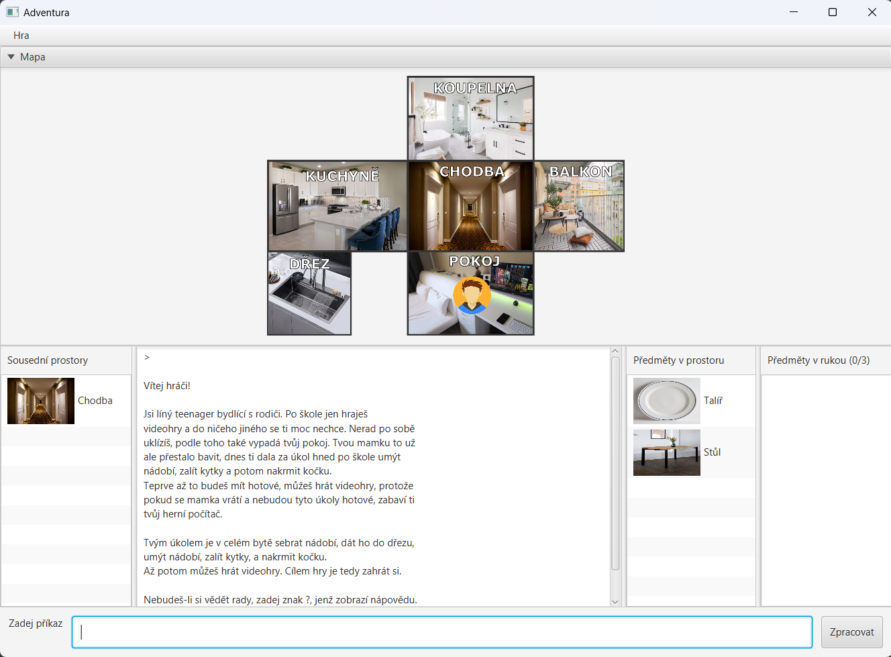

# Nápověda

Jsi líný teenager bydlící s rodiči. Po škole jen hraješ
videohry a do ničeho jiného se ti moc nechce. Nerad po sobě
uklízíš, podle toho také vypadá tvůj pokoj. Tvou mamku to už
ale přestalo bavit, dnes ti dala za úkol hned po škole umýt
nádobí, zalít kytky a potom nakrmit kočku.
Teprve až to budeš mít hotové, můžeš hrát videohry, protože
pokud se mamka vrátí a nebudou tyto úkoly hotové, zabaví ti
tvůj herní počítač.

Tvým úkolem je v celém bytě sebrat nádobí, dát ho do dřezu,
umýt nádobí, zalít kytky, a nakrmit kočku.
Až potom můžeš hrát videohry. Cílem hry je tedy zahrát si.

## MŮŽETE ZADAT TYTO PŘÍKAZY:

- **Hrát_pc_hry** - Příkaz vyhraje hru, pokud se v prostoru nachází nakrmený objekt.

- **Jdi &lt;arg&gt;** - Přesune tě do zadaného sousedního prostoru.

- **Zalij &lt;arg&gt;** - Zalije zadaný předmět, pokud se dá zalít a nachází se v prostoru.

- **Umyj &lt;arg&gt;** - Umyje zadaný předmět, pokud je umytelný a zároveň je položený ve dřezu.

- **Nakrm** - Nakrmí nakrmitelný objekt v prostoru.

- **Vezmi &lt;arg&gt;** - Vezme zadaný předmět z prostoru do tvých rukou. Předmět musí být v aktuálním prostoru, musí být přenositelný
a v rukou na něj musíš mít místo.

- **Konec** - Předčasné ukončení hry.

- **?** - Zobrazí seznam dostupných akcí spolu s jejich stručnými popisy.

- **Polož &lt;arg&gt;** - Zadaný předmět položí z rukou do aktuálního prostoru.

## UI

- V horní části se nachází menu s možností založit novou hru, zavřít hru, nebo zobrazit html nápovědu.  
- Pod menu se nachází mapa, která znázorňuje propojení prostorů a aktuální prostor, vekterém se hráč nachází.  
- Panel sousedních rostorů umožňuje přechod do jednoho ze sousedních prostorů aktuálního prostoru.  
- Konzole vypisuje zadané příkazy a odpovědi hry.  
- Panel předmětů v prostoru umožňuje zvednutí předmětů z prostoru do rukou hráče.  
- Panel předmětů v rukou umožňuje položení předmětu z rukou do aktuálního prostoru.  
- Textfield úplně dole umožňuje zadání ostatních příkazů, které jsou popsány v nápovědě.